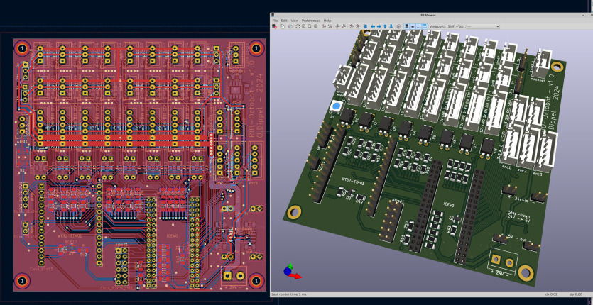
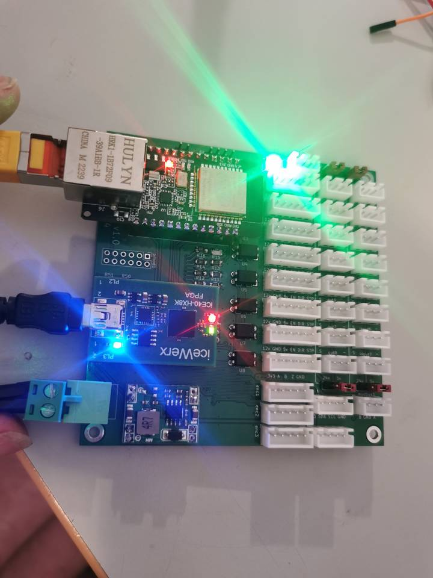

# rio-octobot
8Axis LinuxCNC-RIO main-board - for the iceWerx iCE40-HX8K FPGA-Devboard - kicad project 
 
experimental - not tested yet

## software / gateware
https://github.com/multigcs/riocore

## BOM
https://eu.robotshop.com/de/products/devantech-icewerx-ice40-hx8k-fpga

https://www.amazon.de/WT32-ETH01-Embedded-Schnittstelle-Bluetooth-Entwicklungsplatine/dp/B0CW3DDWZ4

## Forum
German: https://www.cnc-aus-holz.at/index.php?thread/3130-experimente-mit-linux-cnc-auf-raspi-und-ice40-fpga-als-mesa-alternative/&postID=40335#post40335
English: https://forum.linuxcnc.org/18-computer/49142-linuxcnc-rio-realtimeio-for-linuxcnc-based-on-fpga-ice40-ecp5

## Videos

